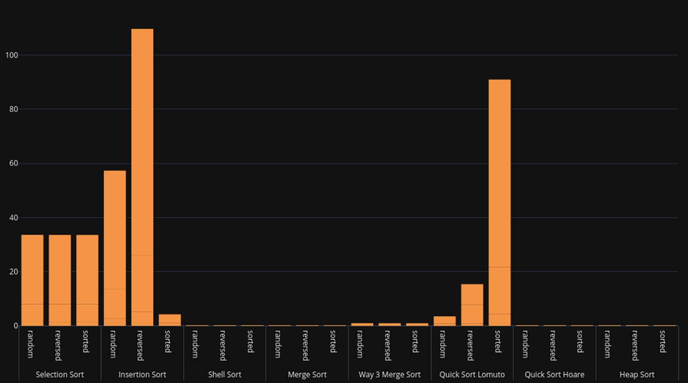
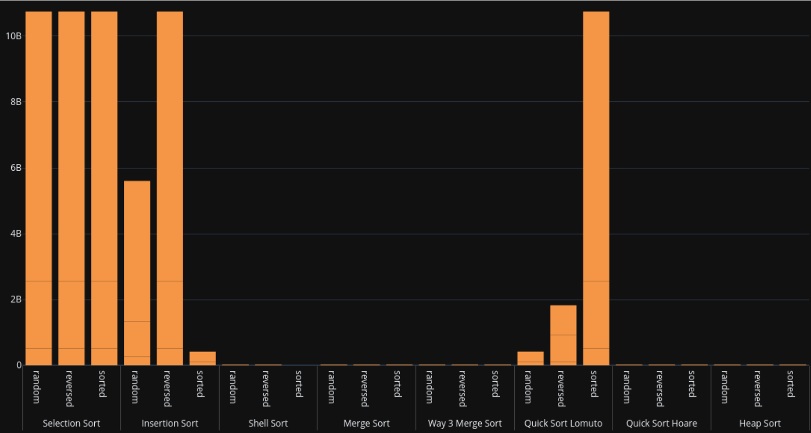
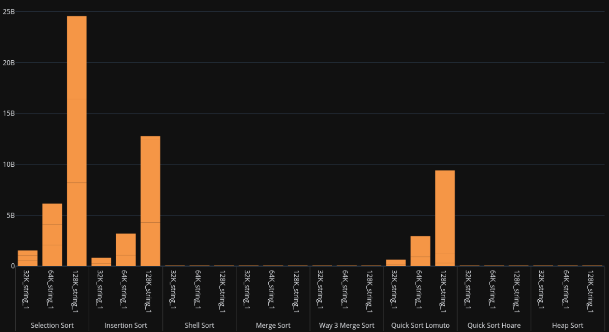
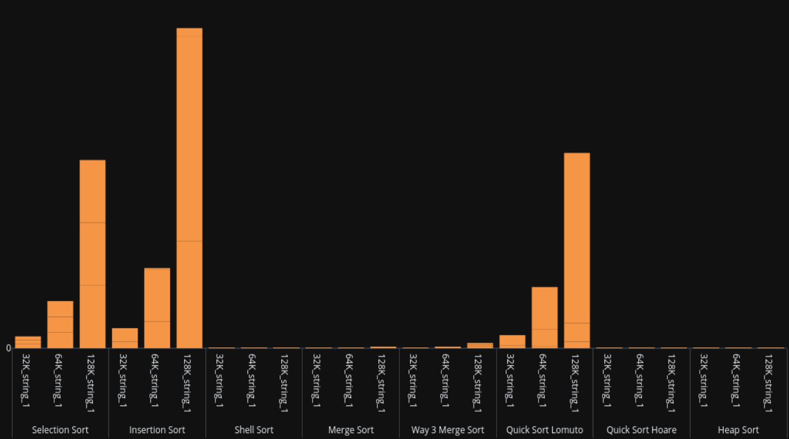

# What is required of us:
1. **Algorithm Implementation:** Implement the following sorting algorithms in c++:
- Selection Sort
- Insertion Sort
- Shellsort
- Merge Sort
- 3-way Merge Sort
- Quick Sort with Lomuto & Hoare partitioning
- Heapsort
2. **Pseudo-code and Time Complexity:** Provide pseudo-code for each algorithm and analyze their time complexities in best, worst, and average cases.
3. **Experimental Design:** Design a comprehensive experimental plan for comparing the algorithms:
- Theoretical comparison: Evaluate their theoretical time complexities.
- Empirical comparison: Conduct experiments with various input sizes and data distributions, measuring actual execution times.

4. This project also try to use paralelizm for algorithm that run more speeder.
## General Comparison

> Input Type - Execution Time

> Input Type - Basic Operation Count

> Input Size - Execution Time

> Input Size - Basic Operation Count

[Detial in Report.pdf](Report.pdf)